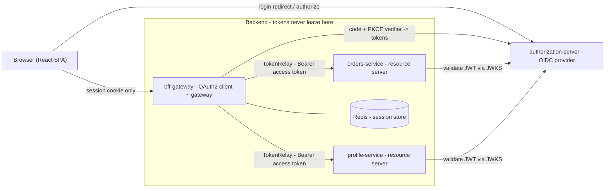
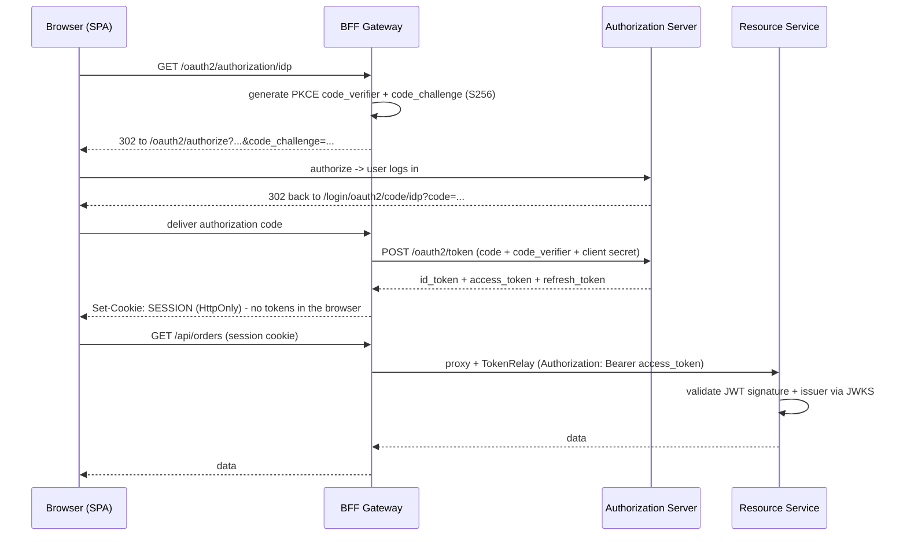

# OAuth 2.1 + OIDC + PKCE Microservices (BFF pattern)

A small, self-contained multi-service playground for learning **how the OAuth 2.1 /
OpenID Connect Authorization Code flow with PKCE is handled on the backend**, using the
**Backend-For-Frontend (BFF)** pattern.

The browser never sees any tokens. It only holds an `HttpOnly` session cookie. All token
handling (Authorization Code + PKCE exchange, refresh, relay to downstream services) happens
on the server, which is the recommended approach for browser-based apps
(OAuth 2.0 for Browser-Based Apps BCP, RFC 9700).

## Services

| Service | Port | Role |
| --- | --- | --- |
| `authorization-server` | 9000 | OpenID Connect Provider (Spring Authorization Server). Login page, users, discovery, JWKS, `/oauth2/authorize`, `/oauth2/token`. |
| `bff-gateway` | 8080 | Backend-For-Frontend. Confidential OAuth2 client (Spring Cloud Gateway). Runs Authorization Code + PKCE, keeps tokens server-side, relays access tokens downstream. |
| `orders-service` | 8081 | JWT resource server. `GET /api/orders`, requires scope `orders.read`. |
| `profile-service` | 8082 | JWT resource server. `GET /api/profile`, requires scope `profile.read`. |
| `frontend` | 5173 (dev) / 8080 (Docker via nginx) | React + Vite SPA. Talks only to the BFF. |
| `redis` | 6379 | Server-side session store for the BFF (where tokens live). |

Tech: Java 21, Spring Boot 3.5.x, Spring Authorization Server 1.5.x, Spring Cloud 2025.0.x,
React 19 + Vite 6.

## Architecture



## The flow (what happens on the backend)



Key backend points, and where to read the code:

- **PKCE is enabled explicitly** on the confidential client via a custom authorization request
  resolver: [`bff-gateway/.../SecurityConfig.java`](bff-gateway/src/main/java/com/example/bff/config/SecurityConfig.java)
  (`OAuth2AuthorizationRequestCustomizers.withPkce()`). PKCE is required by the provider too
  (`requireProofKey(true)` in
  [`authorization-server/.../AuthorizationServerConfig.java`](authorization-server/src/main/java/com/example/authserver/config/AuthorizationServerConfig.java)).
- **Tokens stay server-side**: `oauth2Login()` stores them in the (Redis-backed) session; the
  browser gets only the `SESSION` cookie.
- **TokenRelay**: the gateway swaps the session for a `Bearer` access token when proxying to
  resource servers - see the routes in
  [`bff-gateway/.../application.yml`](bff-gateway/src/main/resources/application.yml).
- **Resource servers are stateless** and just validate the JWT - see
  [`orders-service/.../ResourceServerConfig.java`](orders-service/src/main/java/com/example/orders/config/ResourceServerConfig.java).
- **CSRF**: a JS-readable `XSRF-TOKEN` cookie protects state-changing requests (e.g. logout).
- **Logout** is RP-initiated: local session cleared + redirect to the provider's end-session endpoint.

## Running it

### Option A - Docker Compose (everything at once)

The identity provider must be reachable under the **same** host name by both the browser and the
backend containers. Add this to your `/etc/hosts`:

```
127.0.0.1  idp
```

Then:

```bash
docker compose up --build
```

Open <http://127.0.0.1:8080> and sign in with `alice / password` (or `admin / password`).

### Option B - Run locally with Java + Node

Requires JDK 21, a running Redis on `localhost:6379`, and Node 22.

```bash
# Terminal 1 - authorization server (start first)
./mvnw -pl authorization-server spring-boot:run

# Terminal 2, 3 - resource servers
./mvnw -pl orders-service spring-boot:run
./mvnw -pl profile-service spring-boot:run

# Terminal 4 - BFF gateway
./mvnw -pl bff-gateway spring-boot:run

# Terminal 5 - SPA (Vite dev server, proxies to the gateway)
cd frontend && npm install && npm run dev
```

Open <http://127.0.0.1:5173> and sign in with `alice / password`.

## Try it from the command line

You can drive the whole Authorization Code + PKCE flow with `curl` (this is exactly what the
test script does):

```bash
# 1. Start login - note code_challenge / code_challenge_method=S256 in the redirect
curl -s -i -c bff.jar http://127.0.0.1:8080/oauth2/authorization/idp | grep -i location
```

After authenticating at the IdP and completing the callback, calling the BFF with the session
cookie returns data while the browser never touches a token:

```json
// GET /api/orders (via the BFF)
{"service":"orders-service","owner":"alice","scopes":["orders.read","openid",...],"orders":[...]}
```

## Build and test

```bash
./mvnw clean test      # builds all modules and runs context tests
cd frontend && npm run build
```

## Is this production/government ready?

This project is a **clear reference implementation** to understand the backend flow. The
*pattern* (BFF + Authorization Code + PKCE, tokens server-side, JWT resource servers) is a solid
foundation, but for a production - especially government - deployment you would additionally need:

- **TLS everywhere** (this demo uses `http://127.0.0.1` for convenience) and, ideally, mTLS
  between services.
- A **conformance profile** if mandated (e.g. FAPI 2.0), typically adding **PAR** (RFC 9126) and
  **sender-constrained tokens** via **DPoP** (RFC 9449) or **mTLS** (RFC 8705).
- A real **identity provider** with **MFA / assurance levels** (or an accredited national IdP).
  The IdP here is swappable: point `IDP_ISSUER_URI` at another provider (e.g. Keycloak).
- **Externalized secrets and signing keys** (vault / HSM / KMS, key rotation) - no in-memory
  users or static keys.
- **Auditing / tamper-evident logging**, PII-safe logs, and retention policies.
- **Session hardening** (encryption at rest, idle + absolute timeouts, back-channel logout).
- A **supported runtime** (Spring Boot 3.5 is OSS EOL as of June 2026; use 4.x or commercial
  support), dependency/CVE scanning, and pen testing.
- Accessibility (e.g. WCAG / Section 508) for the login UI.

## Notes on future use (Dubbo / Nacos / Camunda 8)

These are out of scope here, but the Spring Boot 3.5 / Maven choices were made to stay compatible
with that ecosystem. The resource-server microservices are the natural place to add Dubbo RPC,
Nacos discovery/config, and Camunda 8 workflow later, without changing the OAuth architecture.
