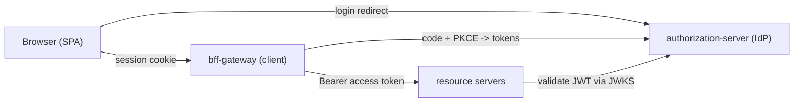

# Security Configuration Guide

This document explains every security-related configuration in the project: the
`authorization-server`, the `bff-gateway`, the two resource servers, and the supporting
`application.yml` / frontend settings.

If you only remember one thing: **the browser never holds tokens**. The BFF is a confidential
OAuth2 client that runs the Authorization Code + PKCE flow, keeps the tokens in a server-side
session, and gives the browser only an `HttpOnly` session cookie. Everything below serves that
model.

---

## Table of contents

1. [The big picture](#1-the-big-picture)
2. [authorization-server](#2-authorization-server)
   - [AuthorizationServerConfig](#21-authorizationserverconfig)
   - [DefaultSecurityConfig](#22-defaultsecurityconfig)
   - [application.yml](#23-authorization-server-applicationyml)
3. [bff-gateway](#3-bff-gateway)
   - [SecurityConfig](#31-securityconfig)
   - [application.yml](#32-bff-gateway-applicationyml)
   - [Frontend CSRF/login/logout](#33-frontend-cooperation)
4. [resource servers (orders / profile)](#4-resource-servers-orders--profile)
5. [Cross-cutting concepts](#5-cross-cutting-concepts)

---

## 1. The big picture

Three trust roles, each configured separately:

| Role | Module | Spring artifact | What it secures |
| --- | --- | --- | --- |
| Authorization Server (IdP) | `authorization-server` | Spring Authorization Server | Issues tokens; authenticates users; the protocol endpoints. |
| Client (BFF) | `bff-gateway` | `spring-boot-starter-oauth2-client` + Spring Cloud Gateway | Runs the login flow, holds tokens, protects the SPA session. |
| Resource Server | `orders-service`, `profile-service` | `spring-boot-starter-oauth2-resource-server` | Validates JWTs and enforces scopes on APIs. |



---

## 2. authorization-server

File locations:
- [`authorization-server/.../config/AuthorizationServerConfig.java`](../authorization-server/src/main/java/com/example/authserver/config/AuthorizationServerConfig.java)
- [`authorization-server/.../config/DefaultSecurityConfig.java`](../authorization-server/src/main/java/com/example/authserver/config/DefaultSecurityConfig.java)
- [`authorization-server/.../resources/application.yml`](../authorization-server/src/main/resources/application.yml)

The authorization server has **two** `SecurityFilterChain` beans on purpose. Spring evaluates them
in `@Order`, and each one owns a different set of URLs.

### 2.1 AuthorizationServerConfig

#### Chain #1 - the OAuth/OIDC protocol endpoints (`@Order(1)`)

```java
OAuth2AuthorizationServerConfigurer authorizationServerConfigurer =
        OAuth2AuthorizationServerConfigurer.authorizationServer();

http
    .securityMatcher(authorizationServerConfigurer.getEndpointsMatcher())   // only /oauth2/**, /.well-known/**, etc.
    .with(authorizationServerConfigurer, authorizationServer ->
            authorizationServer.oidc(Customizer.withDefaults()))            // turn on OpenID Connect
    .authorizeHttpRequests(authorize -> authorize.anyRequest().authenticated())
    .exceptionHandling(exceptions -> exceptions
            .defaultAuthenticationEntryPointFor(
                    new LoginUrlAuthenticationEntryPoint("/login"),         // browsers -> login page
                    new MediaTypeRequestMatcher(MediaType.TEXT_HTML)));
```

- `securityMatcher(...getEndpointsMatcher())` scopes this chain to **only** the well-known
  authorization-server endpoints: `/oauth2/authorize`, `/oauth2/token`, `/oauth2/jwks`,
  `/.well-known/openid-configuration`, `/userinfo`, `/connect/logout`, etc.
- `.oidc(...)` enables the **OpenID Connect** layer (ID tokens, UserInfo, discovery). Without it
  you'd have plain OAuth2 without OIDC.
- The entry point means: if an **unauthenticated browser** hits `/oauth2/authorize`, it's redirected
  to `/login` (handled by chain #2) instead of getting a 401. This is what makes the login prompt
  appear mid-flow.

#### The registered client (who is allowed to ask for tokens)

```java
RegisteredClient.withId(UUID.randomUUID().toString())
    .clientId("bff-client")
    .clientSecret("{noop}bff-secret")                                   // confidential client
    .clientAuthenticationMethod(ClientAuthenticationMethod.CLIENT_SECRET_BASIC)
    .authorizationGrantType(AuthorizationGrantType.AUTHORIZATION_CODE)  // the login flow
    .authorizationGrantType(AuthorizationGrantType.REFRESH_TOKEN)       // silent renewal
    .redirectUri("http://127.0.0.1:8080/login/oauth2/code/idp")         // gateway origin
    .redirectUri("http://127.0.0.1:5173/login/oauth2/code/idp")         // Vite dev origin
    .postLogoutRedirectUri("http://127.0.0.1:8080/")
    .postLogoutRedirectUri("http://127.0.0.1:5173/")
    .scope(OidcScopes.OPENID).scope(OidcScopes.PROFILE)
    .scope("orders.read").scope("profile.read")
    .clientSettings(ClientSettings.builder()
            .requireProofKey(true)                                      // <-- PKCE REQUIRED
            .requireAuthorizationConsent(false)                         // trusted first-party client
            .build())
    .tokenSettings(TokenSettings.builder()
            .accessTokenTimeToLive(Duration.ofMinutes(15))
            .refreshTokenTimeToLive(Duration.ofHours(8))
            .reuseRefreshTokens(false)                                  // refresh-token rotation
            .build())
    .build();
```

Why each setting matters:

- **`{noop}bff-secret`** - the client secret. `{noop}` is a password-encoder id prefix meaning "not
  encoded" (fine for a demo). It only works because the password encoder is a *delegating* encoder
  (see 2.2). The BFF authenticates with this secret over HTTP Basic (`CLIENT_SECRET_BASIC`).
- **`requireProofKey(true)`** - the server **rejects** any authorization request without a PKCE
  `code_challenge`. This is the enforcement half of PKCE (the BFF supplies the challenge; see 3.1).
  RFC 9700 recommends PKCE even for confidential clients to block authorization-code injection,
  because the browser is part of the front-channel redirect.
- **Two redirect URIs** - the allow-list of where codes may be sent back. 8080 is the gateway
  (also the nginx SPA origin in Docker); 5173 is the Vite dev server. Any mismatch is rejected -
  this is a core anti-CSRF/anti-open-redirect control.
- **Scopes** - `openid`+`profile` are OIDC; `orders.read`/`profile.read` map to the two resource
  servers. Scopes become `SCOPE_*` authorities in the access token.
- **Token lifetimes + `reuseRefreshTokens(false)`** - short-lived access tokens and rotating refresh
  tokens limit the blast radius of a leaked token.

#### Token customizer - adding a `roles` claim

```java
@Bean
public OAuth2TokenCustomizer<JwtEncodingContext> tokenCustomizer() {
    return context -> {
        var roles = context.getPrincipal().getAuthorities().stream()
                .map(GrantedAuthority::getAuthority).toList();
        context.getClaims().claim("roles", roles);   // e.g. ["ROLE_USER"]
    };
}
```

By default the JWT carries `scope`. This adds the user's authorities as a `roles` claim so resource
servers can do **role-based** checks in addition to **scope-based** checks.

#### Signing keys and issuer

```java
@Bean JWKSource<SecurityContext> jwkSource() { /* in-memory RSA 2048 keypair */ }
@Bean JwtDecoder jwtDecoder(JWKSource<...> jwks) { ... }   // used to validate ID tokens locally
@Bean AuthorizationServerSettings authorizationServerSettings() {
    return AuthorizationServerSettings.builder().issuer(issuerUri).build();
}
```

- The **RSA private key** signs tokens; the **public key** is published at `/oauth2/jwks` so resource
  servers can verify signatures. In this demo the key is generated fresh at startup (see the
  hardening note below).
- **`issuer`** is the identity of this provider. It is injected from `app.issuer-uri`
  (`@Value("${app.issuer-uri:http://127.0.0.1:9000}")`) so Docker can override it to `http://idp:9000`.
  This value must be reachable under the **same URL** by the browser *and* the backend - see
  [section 5](#5-cross-cutting-concepts).

> Hardening: an in-memory RSA key means tokens are invalidated on every restart and can't be shared
> across instances. Production should load keys from a keystore/HSM/KMS with rotation, and store
> registered clients + users in a database.

### 2.2 DefaultSecurityConfig

#### Chain #2 - end-user login (`@Order(2)`)

```java
http
    .authorizeHttpRequests(authorize -> authorize
        .requestMatchers("/login", "/css/**", "/favicon.ico", "/actuator/health/**").permitAll()
        .anyRequest().authenticated())
    .formLogin(form -> form.loginPage("/login").permitAll());
```

- This chain matches **everything not owned by chain #1** (the login page, static CSS, health).
- `formLogin` renders the custom `/login` page and processes the username/password POST. After a
  successful login, Spring resumes the saved `/oauth2/authorize` request and issues the code.

#### Users and password encoding

```java
@Bean UserDetailsService userDetailsService(PasswordEncoder enc) {
    var alice = User.withUsername("alice").password(enc.encode("password")).roles("USER").build();
    var admin = User.withUsername("admin").password(enc.encode("password")).roles("USER","ADMIN").build();
    return new InMemoryUserDetailsManager(alice, admin);
}

@Bean PasswordEncoder passwordEncoder() {
    return PasswordEncoderFactories.createDelegatingPasswordEncoder();
}
```

- Two demo users, passwords encoded with the **delegating** encoder (stored as `{bcrypt}...`).
- **Why delegating and not plain BCrypt?** Spring Authorization Server uses this same `PasswordEncoder`
  bean to verify the **client secret** too. The client secret is stored as `{noop}bff-secret`. A plain
  `BCryptPasswordEncoder` cannot interpret the `{noop}` prefix, so client authentication failed with
  `invalid_client`. `PasswordEncoderFactories.createDelegatingPasswordEncoder()` reads the `{id}`
  prefix and applies the right algorithm for both user passwords (`{bcrypt}`) and the client secret
  (`{noop}`). (This was a real bug fixed during testing.)

### 2.3 authorization-server application.yml

```yaml
server:
  port: 9000
app:
  issuer-uri: ${ISSUER_URI:http://127.0.0.1:9000}   # overridable for Docker (http://idp:9000)
management:
  endpoints: { web: { exposure: { include: health } } }   # health only, for compose healthchecks
```

---

## 3. bff-gateway

File locations:
- [`bff-gateway/.../config/SecurityConfig.java`](../bff-gateway/src/main/java/com/example/bff/config/SecurityConfig.java)
- [`bff-gateway/.../resources/application.yml`](../bff-gateway/src/main/resources/application.yml)

The gateway is **reactive** (WebFlux), so it uses `ServerHttpSecurity` / `SecurityWebFilterChain`
(the reactive equivalents of `HttpSecurity` / `SecurityFilterChain`).

### 3.1 SecurityConfig

#### The filter chain

```java
http
    .authorizeExchange(exchange -> exchange
        .pathMatchers("/", "/index.html", "/favicon.ico", "/assets/**", "/*.js", "/*.css", "/*.svg").permitAll()
        .pathMatchers("/oauth2/**", "/login/**", "/logout").permitAll()
        .pathMatchers("/api/**").authenticated()      // the only protected area
        .anyExchange().permitAll())
    .oauth2Login(oauth2 -> oauth2
        .authorizationRequestResolver(authorizationRequestResolver))   // enables PKCE (below)
    .logout(logout -> logout.logoutSuccessHandler(logoutSuccessHandler))
    .exceptionHandling(exceptions -> exceptions
        .authenticationEntryPoint(new HttpStatusServerEntryPoint(HttpStatus.UNAUTHORIZED)))
    .csrf(csrf -> csrf
        .csrfTokenRepository(CookieServerCsrfTokenRepository.withHttpOnlyFalse())
        .csrfTokenRequestHandler(new ServerCsrfTokenRequestAttributeHandler()));
```

- **`authorizeExchange`** - the SPA shell and static files are public (the app loads for anonymous
  users), and the OAuth endpoints must be public so login can start. Only **`/api/**`** requires an
  authenticated session - that's where real data flows.
- **`oauth2Login`** - turns the gateway into an OAuth2/OIDC *client*. It handles the redirect to the
  IdP, the `/login/oauth2/code/idp` callback, the token exchange, and stores tokens in the session.
- **`HttpStatusServerEntryPoint(UNAUTHORIZED)`** - when an unauthenticated request hits `/api/**`, the
  gateway returns **401** instead of a 302 redirect to the IdP. A `fetch()` from the SPA can't follow
  a cross-origin redirect to the IdP, so returning 401 lets the SPA show a "Sign in" button instead.
  Login is then a deliberate full-page navigation to `/oauth2/authorization/idp`.
- **CSRF** - see [3.1 CSRF](#csrf-cookie-based-for-a-spa) below.

#### PKCE - the client half

```java
@Bean
public ServerOAuth2AuthorizationRequestResolver authorizationRequestResolver(
        ReactiveClientRegistrationRepository repo) {
    var resolver = new DefaultServerOAuth2AuthorizationRequestResolver(repo);
    resolver.setAuthorizationRequestCustomizer(OAuth2AuthorizationRequestCustomizers.withPkce());
    return resolver;
}
```

Spring Security does **not** add PKCE for confidential clients automatically. `withPkce()`:
- generates a random `code_verifier`,
- derives the `code_challenge` (`S256`) and appends it to the `/oauth2/authorize` request,
- keeps the `code_verifier` in the server-side authorization request (never sent to the browser),
- and replays it during the token exchange so the IdP can prove the same client that started the
  flow is the one redeeming the code.

This is the counterpart to `requireProofKey(true)` on the server (2.1).

#### RP-initiated logout

```java
@Bean
public ServerLogoutSuccessHandler logoutSuccessHandler(ReactiveClientRegistrationRepository repo) {
    var handler = new OidcClientInitiatedServerLogoutSuccessHandler(repo);
    handler.setPostLogoutRedirectUri("http://127.0.0.1:8080/");
    return handler;
}
```

On `POST /logout` the gateway clears the local session **and** redirects the browser to the IdP's
`end_session_endpoint` (with an `id_token_hint`) so the user is signed out at the IdP too, then back
to the post-logout URI. Without this, the local cookie would be cleared but the IdP session would
persist (instant silent re-login).

#### CSRF (cookie-based, for a SPA)

```java
.csrf(csrf -> csrf
    .csrfTokenRepository(CookieServerCsrfTokenRepository.withHttpOnlyFalse())     // JS-readable cookie
    .csrfTokenRequestHandler(new ServerCsrfTokenRequestAttributeHandler()));      // expect the RAW token
```

```java
@Bean
public WebFilter csrfCookieWebFilter() {   // force the XSRF-TOKEN cookie to actually be written
    return (exchange, chain) -> {
        Mono<CsrfToken> csrfToken = exchange.getAttribute(CsrfToken.class.getName());
        return (csrfToken != null ? csrfToken.then() : Mono.empty()).then(chain.filter(exchange));
    };
}
```

- Because the app uses **session cookies**, it is exposed to CSRF, so CSRF protection is **on** for
  state-changing requests (e.g. `POST /logout`).
- `CookieServerCsrfTokenRepository.withHttpOnlyFalse()` writes the token to an `XSRF-TOKEN` cookie that
  JavaScript **can** read, so the SPA can send it back (in the `_csrf` form field or `X-XSRF-TOKEN`
  header).
- **Why the plain `ServerCsrfTokenRequestAttributeHandler`?** The default handler XOR-masks the token
  (BREACH mitigation for tokens rendered into HTML). A SPA reading the cookie only has the **raw**
  token and cannot produce the masked form, so validation failed (`Base64-decoded length 27 != 72`).
  BREACH masking only matters when the token is reflected in an HTML *body*, which never happens here
  (the token is delivered via a `Set-Cookie` header), so the plain handler is the correct, safe choice.
  (Also a real bug fixed during testing.)
- The `csrfCookieWebFilter` subscribes to the deferred `CsrfToken` so the cookie is written even on
  requests that don't otherwise read it - otherwise the SPA might never receive a token to echo back.

### 3.2 bff-gateway application.yml

```yaml
server:
  port: 8080
  forward-headers-strategy: framework      # honor X-Forwarded-* behind nginx (correct redirect URIs)

spring:
  data: { redis: { host: ${REDIS_HOST:localhost}, port: ${REDIS_PORT:6379} } }
  session:
    store-type: redis                       # tokens live in the server-side session, in Redis
    timeout: 30m

  security:
    oauth2:
      client:
        provider:
          idp:
            issuer-uri: ${IDP_ISSUER_URI:http://127.0.0.1:9000}   # OIDC discovery
        registration:
          idp:
            provider: idp
            client-id: bff-client
            client-secret: bff-secret
            authorization-grant-type: authorization_code
            redirect-uri: "{baseUrl}/login/oauth2/code/idp"
            scope: [openid, profile, orders.read, profile.read]

  cloud:
    gateway:
      server:
        webflux:
          default-filters:
            - SaveSession                   # persist session (with tokens) BEFORE routing
            - TokenRelay                    # swap session -> Bearer access token on the downstream call
          routes:
            - id: orders-service
              uri: ${ORDERS_URI:http://127.0.0.1:8081}
              predicates: [ "Path=/api/orders/**" ]
            - id: profile-service
              uri: ${PROFILE_URI:http://127.0.0.1:8082}
              predicates: [ "Path=/api/profile/**" ]
```

The security-relevant lines:

- **`issuer-uri`** - the gateway discovers the IdP's endpoints and JWKS from
  `/.well-known/openid-configuration`. It also fixes the expected `iss` for ID token validation.
- **`redirect-uri: {baseUrl}/login/oauth2/code/idp`** - `{baseUrl}` is resolved per-request from the
  browser-facing origin (which is why `forward-headers-strategy` matters behind nginx). It must match
  a redirect URI registered on the server (2.1).
- **`store-type: redis`** - the OAuth tokens are held in the server-side session. Redis makes the
  session survive restarts and be shared across multiple gateway instances; the browser only ever has
  the opaque `SESSION` cookie.
- **`SaveSession` + `TokenRelay`** - the cornerstone of the BFF. `SaveSession` guarantees the session
  (holding the tokens) is persisted before proxying; `TokenRelay` reads the access token from the
  session and adds `Authorization: Bearer <token>` on the outbound call to the resource server. The
  browser sends **no** bearer token - just the cookie.
- **Route predicates** - only `/api/orders/**` and `/api/profile/**` are proxied; anything else is
  served locally (SPA/`/api/me`).

### 3.3 Frontend cooperation

See [`frontend/src/api.js`](../frontend/src/api.js). The SPA:
- calls `/api/**` with `credentials: 'same-origin'` (sends the `SESSION` cookie automatically),
- treats **401** from `/api/me` as "not signed in" and shows a login button,
- **login** = full-page navigation to `/oauth2/authorization/idp` (so the browser follows the OAuth
  redirects),
- **logout** = a form `POST /logout` that includes the `_csrf` value read from the `XSRF-TOKEN`
  cookie (so the browser follows the RP-initiated logout redirect to the IdP and back).

The Vite dev proxy ([`frontend/vite.config.js`](../frontend/vite.config.js)) forwards the BFF paths to
the gateway with `changeOrigin: false` so the gateway sees the real browser Host (`127.0.0.1:5173`)
and builds the correct redirect URI.

---

## 4. resource servers (orders / profile)

File locations (both mirror each other):
- [`orders-service/.../config/ResourceServerConfig.java`](../orders-service/src/main/java/com/example/orders/config/ResourceServerConfig.java)
- [`orders-service/.../resources/application.yml`](../orders-service/src/main/resources/application.yml)

```java
http
    .authorizeHttpRequests(authorize -> authorize
        .requestMatchers("/actuator/health/**").permitAll()
        .requestMatchers("/api/orders/**").hasAuthority("SCOPE_orders.read")   // scope-based access
        .anyRequest().authenticated())
    .oauth2ResourceServer(oauth2 -> oauth2.jwt(Customizer.withDefaults()))       // validate JWTs
    .sessionManagement(session -> session.sessionCreationPolicy(SessionCreationPolicy.STATELESS));
```

```yaml
spring:
  security:
    oauth2:
      resourceserver:
        jwt:
          issuer-uri: ${IDP_ISSUER_URI:http://127.0.0.1:9000}
```

- **`oauth2ResourceServer().jwt()`** - every request must present a valid `Bearer` JWT. Using
  `issuer-uri`, Spring fetches the JWKS and validates the token's **signature**, **expiry**, and
  **issuer** on each call. No shared secret with the IdP is needed - just the public keys.
- **`hasAuthority("SCOPE_orders.read")`** - Spring maps the token's `scope` claim to `SCOPE_*`
  authorities. `orders-service` requires `SCOPE_orders.read`; `profile-service` requires
  `SCOPE_profile.read`. A token without the right scope gets **403**, no token gets **401**.
- **`STATELESS`** - resource servers keep no session and set no cookie; identity comes entirely from
  the JWT on each request. This is what makes them trivially horizontally scalable.

> Note: the resource servers never see the client secret, the login, or the refresh token. They only
> trust the IdP's signature. This clean separation is a key benefit of the pattern.

---

## 5. Cross-cutting concepts

### Cookies used
| Cookie | Set by | HttpOnly | Purpose |
| --- | --- | --- | --- |
| `SESSION` | bff-gateway (Spring Session) | yes | References the server-side session that holds the tokens. |
| `XSRF-TOKEN` | bff-gateway (CSRF repo) | no | CSRF token the SPA reads and echoes back on writes. |
| `JSESSIONID` | authorization-server | yes | The user's login session at the IdP (separate origin). |

Because cookies are scoped by host (not port), the BFF (`SESSION`) and the IdP (`JSESSIONID`) use
**different names**, so they don't collide on `127.0.0.1`.

### Issuer consistency (a common pitfall)
The `issuer` URL must be identical for:
- the browser (it is redirected to `<issuer>/oauth2/authorize`),
- the BFF (server-to-server token exchange + discovery),
- the resource servers (JWKS fetch + `iss` validation).

Locally that's `http://127.0.0.1:9000`. In Docker the containers can't reach `127.0.0.1`, so we use a
shared hostname **`idp`** (`ISSUER_URI=http://idp:9000`) that resolves both inside the compose network
and from the browser (via a `127.0.0.1 idp` entry in `/etc/hosts`). Mismatched issuers cause
`invalid_token` / discovery failures.

### Scopes vs. roles
- **Scopes** (`orders.read`, `profile.read`) express what the *client* is allowed to do and drive API
  authorization (`SCOPE_*`).
- **Roles** (`ROLE_USER`, `ROLE_ADMIN`) describe the *user* and are added via the token customizer as a
  `roles` claim for finer-grained checks.

### Token lifetimes
Access tokens live 15 minutes; refresh tokens 8 hours and rotate on use. The BFF refreshes silently
using the refresh token in the session, so the SPA never deals with expiry.

### Not production-hardened (by design)
This is a learning reference. For production see the checklist in the main
[`README.md`](../README.md#is-this-productiongovernment-ready): TLS/mTLS, externalized keys (HSM/KMS)
and client/user stores, MFA, FAPI 2.0 + PAR + DPoP if required, audit logging, and a supported Spring
Boot line.
